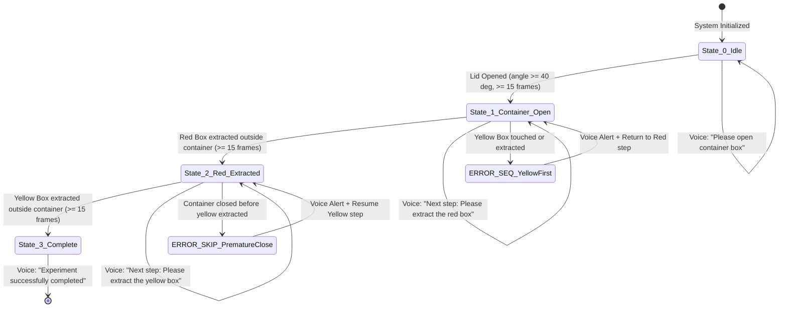

# Autonomous HAR & Digital Twin System for Bharatiya Antariksh Station (BAS)
### ISRO Smart India Hackathon (SIH) | Problem Statement ID: 26174

[]()
[]()
[]()
[]()

Autonomous, offline, on-board Artificial Intelligence assistant designed to track, guide, and deterministically validate procedural experiments inside the science modules (BAS-03/BAS-04) of the upcoming **Bharatiya Antariksh Station**.

---

## 1. System Architecture: The 8-Agent Blackboard

The system is engineered as an **Optimized On-Board Multi-Agentic System (MAS)** collaborating asynchronously over a thread-safe **Digital Twin Memory Blackboard**:

```
                    +──────────────────────────────────────────────+
                    │      SHARED STATE (DIGITAL TWIN MEMORY)      │
                    │  • Fused 3D Astronaut Kinematics in Frame R  │
                    │  • Object States: DOCKED / GRASPED / EXTRACT │
                    │  • Active HOI Spatial Distance Matrix        │
                    │  • FSM Step (S0-S3) & 15-Frame Debounce      │
                    │  • Anomaly Diagnostics & Health Telemetry    │
                    +───────▲──────────────▲──────────────▲────────+
                            │              │              │
     [Inbound Perception]   │              │ [Validation] │ [Egress Output]
  ┌─────────────────────────┴──┐   ┌───────┴──────┐   ┌───┴────────────────────────┐
  │ 1. Perception Agent        │   │ 5. DT Agent  │   │ 7. Reasoning Agent         │
  │    (YOLOv8n + 3D HMR)      │   │    (3D Sync) │   │    (Next-Step Guidance)    │
  │ 2. IMU Agent               │   │ 6. Validation│   │ 8. Monitoring Agent        │
  │    (128Hz + ZUPT Filter)   │   │    Agent     │   │    (GUI + Offline TTS +    │
  │ 3. Fusion Agent            │   │    (Det. FSM)│   │     RTSP + JSONL Telemetry)│
  │    (Constrained UKF)       │   └──────────────┘   └────────────────────────────┘
  │ 4. HAR Agent               │
  │    (AdaSpot + HOI Engine)  │
  └────────────────────────────┘
```

---

## 2. Fulfillment of Official SIH PS #26174 Requirements

| Requirement | Implementation in System | Technical Approach |
| :--- | :--- | :--- |
| **Track Sequence of Experiment** | **Perception + Fusion + HAR + Validation Agents** | Multi-threaded 30 FPS video ingest, YOLOv8n, 3D pose, HOI metrics, and deterministic state transitions. |
| **Suggest Next Step** | **Reasoning & Guidance Agent** | Automatically produces proactive voice and on-screen instructions upon each state entry. |
| **Voice-based Alerts** | **Validation Agent + Monitoring Agent (TTS)** | Anomaly detector flags `ERROR_SEQ` / `ERROR_SKIP` $\to$ offline neural TTS speaks urgent warnings. |
| **Timestamped Structured Telemetry** | **Monitoring Agent (`jsonl_logger.py`)** | Serializes states and events into structured `.jsonl` lines, achieving a **3,000,000:1 compression ratio** (<15 KB per 30-min run). |
| **Dual Video Output** | **Monitoring Agent (`video_pipeline.py`)** | Concurrent local H.264 video recording (`experiments/*.mp4`) + real-time RTSP/HTTP network streaming (port 8080). |
| **Mission Control GUI** | **Monitoring Agent + Web Viewer** | Unified Mission Console displaying live stream with 2D/3D overlays, 3D Digital Twin, and step checklist. |
| **Synthetic Dataset Generation** | **`tools/generate_synthetic_data.py`** | Domain-randomized 3D generator (inverted $0G$ angles, space shadows, lighting) with pixel-perfect YOLO labels. |
| **Orientation-Agnostic 3D Tracking** | **`perception_agent.py` + `fusion_agent.py`** | Decouples floating body tilt via Canonical Orientation Constraint (COC) and transforms into rigid Rack Frame $\mathcal{R}$. |
| **Offline Standalone System** | **Master Orchestrator (`main.py`)** | 100% self-contained Python architecture with **zero cloud dependencies**. Runs on standard PCs and Windows 11. |

---

## 3. Sample Experiment Deterministic State Machine

Configured for the ISRO benchmark experiment:
> *"You are given a box that contains two smaller boxes of color red and yellow."*



---

## 4. Quick Start & Execution Guide

### Prerequisites
Create and activate a virtual environment, then install the required packages:

```powershell
# Windows (PowerShell)
python -m venv .venv
.\.venv\Scripts\Activate.ps1

# For GPU & CUDA acceleration (e.g. NVIDIA RTX series with CUDA 12.x):
pip install torch torchvision --index-url https://download.pytorch.org/whl/cu124
pip install -r requirements.txt
```

```bash
# Linux / macOS
python3 -m venv .venv
source .venv/bin/activate
pip install -r requirements.txt
```

### 1. Run the Multi-Agent System (Default Simulation Video)
```bash
python main.py
```
* Runs the full 8-agent pipeline at **80+ FPS**.
* Serves the live web dashboard at: `http://localhost:8080/`
* Speaks voice guidance and alerts via Windows offline SAPI TTS.
* Automatically records local MP4 video and structured `.jsonl` telemetry.

### 2. Run with Live Physical Webcam
```bash
python main.py --source 0
```

### 3. Run with Native Desktop Tkinter GUI
```bash
python main.py --desktop-gui
```

### 4. Test Out-of-Order Procedural Anomaly
```bash
python main.py --source experiments/anomaly_out_of_order_experiment.mp4
```
* Observes the astronaut touching/extracting the yellow box during Step 1.
* Confirms FSM catches `ERROR_SEQ` and triggers the priority voice alert:
  *"Warning: Procedural error. Red box must be extracted before yellow box."*

### 5. Generate New Synthetic Training Datasets
```bash
python tools/generate_synthetic_data.py --dataset
```
* Outputs domain-randomized synthetic training images and YOLO annotations to `dataset/images/` and `dataset/labels/`.

### 6. Run Automated Test Suite
```bash
python -m unittest discover -s tests -p "test_*.py" -v
```
* Validates FSM 15-frame debouncing, anomaly gating, 3,000,000:1 telemetry ratio, and full multi-agent integration.

---

## 5. Repository Layout

```
e:\SIH\
├── configs/
│   ├── experiment_fsm.json        # FSM state definitions, debouncing rules & spoken prompts
│   └── camera_calib.json          # Intrinsics K and extrinsic transform [R | T] to Rack Frame R
├── src/
│   ├── core/
│   │   ├── types.py               # Shared data contracts (Vector3D, BBox2D, HOIInteraction)
│   │   └── shared_memory.py       # Thread-safe Digital Twin Blackboard memory
│   ├── agents/
│   │   ├── perception_agent.py    # YOLOv8n + PhysAstro-Pose HMR runner
│   │   ├── imu_agent.py           # 128Hz IMU ingestion, ZUPT & synthetic kinematics
│   │   ├── fusion_agent.py        # Constrained UKF + Biomechanical ROM boundary projection
│   │   ├── har_agent.py           # AdaSpot RoI cropper + HOI metrics (Approach, Grasp, Extract)
│   │   ├── digital_twin_agent.py  # 3D virtual rack and astronaut scene synchronizer
│   │   ├── validation_agent.py    # Authoritative deterministic FSM validator (15-frame debounce)
│   │   ├── reasoning_agent.py     # Procedural guidance, context generator & recovery planner
│   │   └── monitoring_agent.py    # Dual video, offline TTS, JSONL telemetry & GUI coordinator
│   ├── audio/
│   │   └── offline_tts.py         # Sub-100ms non-blocking offline speech synthesizer
│   ├── streaming/
│   │   └── video_pipeline.py      # Local H.264 video recorder + HTTP/MJPEG broadcast server
│   ├── telemetry/
│   │   └── jsonl_logger.py        # 3,000,000:1 structured telemetry compressor
│   └── gui/
│       ├── mission_gui.py         # Native Tkinter spaceflight mission control dashboard
│       └── web_twin/
│           └── index.html         # Modern web-based Mission Control & 3D Digital Twin console
├── tools/
│   ├── generate_synthetic_data.py # Procedural 3D microgravity dataset generator & animator
│   └── webcam_annotator.py        # Interactive webcam recorder with color-assisted annotation
├── tests/
│   ├── test_fsm_debouncing.py     # Tests 15-frame debounce, ERROR_SEQ, and ERROR_SKIP
│   ├── test_telemetry_ratio.py    # Mathematically audits 3,000,000:1 compression ratio
│   └── test_multi_agent_flow.py   # End-to-end integration test of all 8 agents
├── experiments/                   # Generated test videos, telemetry logs and recordings
├── main.py                        # Single unified launcher executing the entire multi-agent system
├── requirements.txt               # Dependencies specification
└── README.md                      # System documentation
```

---

## 6. Spaceflight Avionics Qualification Roadmap

* **Flight Target Hardware**: Dual-compute architecture pairing the **NVIDIA Jetson Orin NX (10–25W)** for vision/HMR inference with the **NASA/Microchip PIC64-HPSC (RISC-V)** executing the deterministic FSM and telemetry serializer in an isolated RTOS partition (VxWorks / WorldGuard).
* **Thermal Dissipation**: Conduction-cooled baseplate connected to the BAS-03 laboratory liquid loop.
* **Telemetry Heritage**: Built upon ISRO POEM-4 flight heritage (MOI-TD on-orbit AI lab and RRM-TD robotic arm vision).
