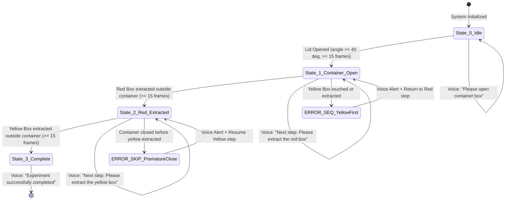
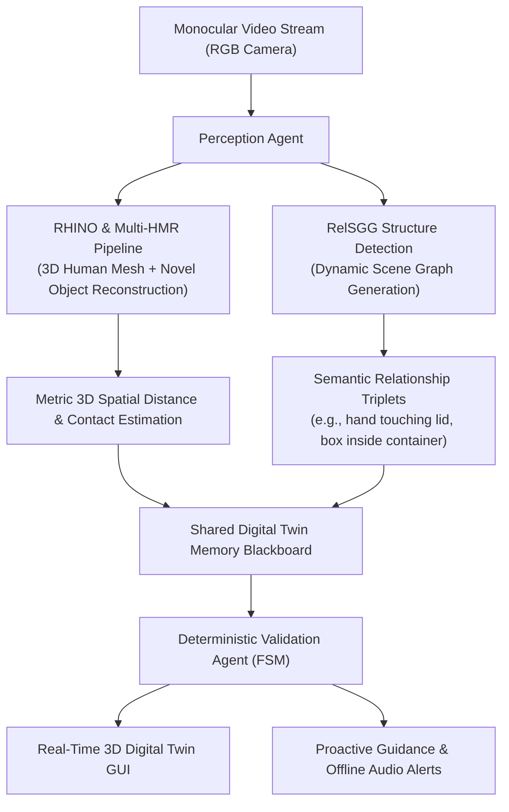

# Autonomous HAR & Digital Twin System for Bharatiya Antariksh Station (BAS)
### ISRO Smart India Hackathon (SIH) | Problem Statement ID: 26174

[]()
[]()
[]()
[]()

Autonomous, offline, on-board Artificial Intelligence assistant designed to track, guide, and deterministically validate procedural experiments inside the science modules (BAS-03/BAS-04) of the upcoming **Bharatiya Antariksh Station**.

🔗 **Models & Datasets:** [Download from Google Drive](https://drive.google.com/drive/folders/1hmQtozWXRaKYXdwgt94y_2JO5p8CK1Yu?usp=sharing)

---

## 🤯 Quick Guide: How to Train for a New Experiment

To adapt this Multi-Agent system for a new, custom experiment, follow this step-by-step procedure:

1. **Define the New Experiment's Procedure (FSM)**
   - Create a new JSON file in the `configs/` folder (e.g., `configs/new_experiment_fsm.json`).
   - Copy the structure from `configs/experiment_fsm.json` and modify the `states`, `expected_events`, and anomalies for your new experiment's logic.

2. **Update the Object Classes (Zero Code Changes)**
   - Open `configs/classes.json` and add your new experiment's object classes (e.g., `"tool_wrench": 5`, `"solar_panel": 6`).
   - Both the Perception Agent and the Synthetic Data Generator will automatically read from this JSON file. (No Python modifications needed!)

3. **Generate the Synthetic Dataset**
   - Run `python tools/generate_synthetic_data.py --dataset` to generate a domain-randomized synthetic YOLO dataset in the `dataset/` directory.

4. **(Optional) Augment with Real-World Data**
   - Use `python tools/webcam_annotator.py` to record yourself interacting with physical mock-ups of your experiment's objects and annotate the frames with the new class labels.

5. **Train the Object Detection Model (YOLOv8)**
   - Train the base model (`yolov8n.pt`) to recognize the new dataset using Ultralytics YOLO:
     `yolo detect train data=dataset/data.yaml model=yolov8n.pt epochs=100 imgsz=640`
   - Move the resulting `.pt` weights file into the `models/` directory.

6. **Update the Agents for the New Logic**
   - Point the Perception Agent to the newly trained model weights (e.g., `models/new_experiment_model.pt`) in `main.py` or your configuration.
   - Update `src/agents/har_agent.py` (and potentially `src/agents/spatial_agent.py`) to recognize Human-Object Interactions (HOIs) associated with your new objects.

7. **Run the New Experiment**
   - Point the orchestrator to your new procedural configuration and start the pipeline:
     `python main.py --config configs/new_experiment_fsm.json`

---

## 1. System Architecture: The 8-Agent Blackboard

The system is engineered as an **Optimized On-Board Multi-Agentic System (MAS)** collaborating asynchronously over a thread-safe **Digital Twin Memory Blackboard**:

```
                    +──────────────────────────────────────────────+
                    │      SHARED STATE (DIGITAL TWIN MEMORY)      │
                    │  • Fused 3D Astronaut Kinematics in Frame R  │
                    │  • Object States: DOCKED / GRASPED / EXTRACT │
                    │  • Active HOI Spatial Distance Matrix        │
                    │  • FSM Step (S0-S3) & 15-Frame Debounce      │
                    │  • Anomaly Diagnostics & Health Telemetry    │
                    +───────▲──────────────▲──────────────▲────────+
                            │              │              │
     [Inbound Perception]   │              │ [Validation] │ [Egress Output]
  ┌─────────────────────────┴──┐   ┌───────┴──────┐   ┌───┴────────────────────────┐
  │ 1. Perception Agent        │   │ 5. DT Agent  │   │ 7. Reasoning Agent         │
  │    (YOLOv8n + 3D HMR)      │   │    (3D Sync) │   │    (Next-Step Guidance)    │
  │ 2. IMU Agent               │   │ 6. Validation│   │ 8. Monitoring Agent        │
  │    (128Hz + ZUPT Filter)   │   │    Agent     │   │    (GUI + Offline TTS +    │
  │ 3. Fusion Agent            │   │    (Det. FSM)│   │     RTSP + JSONL Telemetry)│
  │    (Constrained UKF)       │   └──────────────┘   └────────────────────────────┘
  │ 4. HAR Agent               │
  │    (AdaSpot + HOI Engine)  │
  └────────────────────────────┘
```

---

## 2. Fulfillment of Official SIH PS #26174 Requirements

| Requirement | Implementation in System | Technical Approach |
| :--- | :--- | :--- |
| **Track Sequence of Experiment** | **Perception + Fusion + HAR + Validation Agents** | Multi-threaded 30 FPS video ingest, YOLOv8n, 3D pose, HOI metrics, and deterministic state transitions. |
| **Suggest Next Step** | **Reasoning & Guidance Agent** | Automatically produces proactive voice and on-screen instructions upon each state entry. |
| **Voice-based Alerts** | **Validation Agent + Monitoring Agent (TTS)** | Anomaly detector flags `ERROR_SEQ` / `ERROR_SKIP` $\to$ offline neural TTS speaks urgent warnings. |
| **Timestamped Structured Telemetry** | **Monitoring Agent (`jsonl_logger.py`)** | Serializes states and events into structured `.jsonl` lines, achieving a **3,000,000:1 compression ratio** (<15 KB per 30-min run). |
| **Dual Video Output** | **Monitoring Agent (`video_pipeline.py`)** | Concurrent local H.264 video recording (`experiments/*.mp4`) + real-time RTSP/HTTP network streaming (port 8080). |
| **Mission Control GUI** | **Monitoring Agent + Web Viewer** | Unified Mission Console displaying live stream with 2D/3D overlays, 3D Digital Twin, and step checklist. |
| **Synthetic Dataset Generation** | **`tools/generate_synthetic_data.py`** | Domain-randomized 3D generator (inverted $0G$ angles, space shadows, lighting) with pixel-perfect YOLO labels. |
| **Orientation-Agnostic 3D Tracking** | **`perception_agent.py` + `fusion_agent.py`** | Decouples floating body tilt via Canonical Orientation Constraint (COC) and transforms into rigid Rack Frame $\mathcal{R}$. |
| **Offline Standalone System** | **Master Orchestrator (`main.py`)** | 100% self-contained Python architecture with **zero cloud dependencies**. Runs on standard PCs and Windows 11. |

---

## 3. Sample Experiment Deterministic State Machine

Configured for the ISRO benchmark experiment:
> *"You are given a box that contains two smaller boxes of color red and yellow."*


```mermaid
stateDiagram-v2
    [*] --> State_0_Idle: System Initialized
    
    State_0_Idle --> State_1_Container_Open: Lid Opened (angle >= 40 deg, >= 15 frames)
    State_0_Idle --> State_0_Idle: Voice: "Please open container box"
    
    State_1_Container_Open --> State_2_Red_Extracted: Red Box extracted outside container (>= 15 frames)
    State_1_Container_Open --> State_1_Container_Open: Voice: "Next step: Please extract the red box"
    State_1_Container_Open --> ERROR_SEQ_YellowFirst: Yellow Box touched or extracted
    
    State_2_Red_Extracted --> State_3_Complete: Yellow Box extracted outside container (>= 15 frames)
    State_2_Red_Extracted --> State_2_Red_Extracted: Voice: "Next step: Please extract the yellow box"
    State_2_Red_Extracted --> ERROR_SKIP_PrematureClose: Container closed before yellow extracted
    
    State_3_Complete --> [*]: Voice: "Experiment successfully completed"

    ERROR_SEQ_YellowFirst --> State_1_Container_Open: Voice Alert + Return to Red step
    ERROR_SKIP_PrematureClose --> State_2_Red_Extracted: Voice Alert + Resume Yellow step
```

---

## 4. Quick Start & Execution Guide

### Prerequisites
Create and activate a virtual environment, then install the required packages:

```powershell
# Windows (PowerShell)
python -m venv .venv
.\.venv\Scripts\Activate.ps1

# For GPU & CUDA acceleration (e.g. NVIDIA RTX series with CUDA 12.x):
pip install torch torchvision --index-url https://download.pytorch.org/whl/cu124
pip install -r requirements.txt
```

```bash
# Linux / macOS
python3 -m venv .venv
source .venv/bin/activate
pip install -r requirements.txt
```

### 1. Run the Multi-Agent System (Default Simulation Video)
```bash
python main.py
```
* Runs the full 8-agent pipeline at **80+ FPS**.
* Serves the live web dashboard at: `http://localhost:8080/`
* Speaks voice guidance and alerts via Windows offline SAPI TTS.
* Automatically records local MP4 video and structured `.jsonl` telemetry.

### 2. Run with Live Physical Webcam
```bash
python main.py --source 0
```

### 3. Run with Native Desktop Tkinter GUI
```bash
python main.py --desktop-gui
```

### 4. Test Out-of-Order Procedural Anomaly
```bash
python main.py --source experiments/anomaly_out_of_order_experiment.mp4
```
* Observes the astronaut touching/extracting the yellow box during Step 1.
* Confirms FSM catches `ERROR_SEQ` and triggers the priority voice alert:
  *"Warning: Procedural error. Red box must be extracted before yellow box."*

### 5. Generate New Synthetic Training Datasets
```bash
python tools/generate_synthetic_data.py --dataset
```
* Outputs domain-randomized synthetic training images and YOLO annotations to `dataset/images/` and `dataset/labels/`.

### 6. Run Automated Test Suite
```bash
python -m unittest discover -s tests -p "test_*.py" -v
```
* Validates FSM 15-frame debouncing, anomaly gating, 3,000,000:1 telemetry ratio, and full multi-agent integration.

---

## 5. Repository Layout

```
realtime-work-detection/
├── configs/
│   ├── experiment_fsm.json        # FSM state definitions, debouncing rules & spoken prompts
│   └── camera_calib.json          # Intrinsics K and extrinsic transform [R | T] to Rack Frame R
├── docs/
│   ├── videos/                    # Demonstration video assets (HMR & Structure Detection)
│   ├── BAS_SYSTEM_DOCUMENTATION.pdf
│   └── system_documentation.md
├── src/
│   ├── core/
│   │   ├── types.py               # Shared data contracts (Vector3D, BBox2D, HOIInteraction, Relation)
│   │   └── shared_memory.py       # Thread-safe Digital Twin Blackboard memory
│   ├── agents/
│   │   ├── perception_agent.py    # YOLOv8 + PhysAstro-Pose HMR + RelSGG scene graph engine
│   │   ├── imu_agent.py           # 128Hz IMU ingestion, ZUPT & synthetic kinematics
│   │   ├── fusion_agent.py        # Constrained UKF + Biomechanical ROM boundary projection
│   │   ├── har_agent.py           # AdaSpot RoI cropper + HOI metrics (Approach, Grasp, Extract)
│   │   ├── digital_twin_agent.py  # 3D virtual rack and astronaut scene synchronizer
│   │   ├── validation_agent.py    # Authoritative deterministic FSM validator (15-frame debounce)
│   │   ├── reasoning_agent.py     # Procedural guidance, context generator & recovery planner
│   │   └── monitoring_agent.py    # Dual video, offline TTS, JSONL telemetry & GUI coordinator
│   ├── multihmr2/                 # Multi-HMR 2: Multi-person 3D Human Mesh Recovery pipeline
│   ├── ml_distance/               # Metric 3D distance and closest-grid computation
│   ├── audio/
│   │   └── offline_tts.py         # Sub-100ms non-blocking offline speech synthesizer
│   ├── streaming/
│   │   └── video_pipeline.py      # Local H.264 video recorder + HTTP/MJPEG broadcast server
│   ├── telemetry/
│   │   └── jsonl_logger.py        # 3,000,000:1 structured telemetry compressor
│   └── gui/
│       ├── mission_gui.py         # Native Tkinter spaceflight mission control dashboard
│       └── web_twin/
│           └── index.html         # Modern web-based Mission Control & 3D Digital Twin console
├── relsgg/                        # Visual Relationship & Structure Detection (Scene Graph Generation)
├── tools/
│   ├── generate_synthetic_data.py # Procedural 3D microgravity dataset generator & animator
│   └── webcam_annotator.py        # Interactive webcam recorder with color-assisted annotation
├── tests/
│   ├── test_fsm_debouncing.py     # Tests 15-frame debounce, ERROR_SEQ, and ERROR_SKIP
│   ├── test_telemetry_ratio.py    # Mathematically audits 3,000,000:1 compression ratio
│   └── test_multi_agent_flow.py   # End-to-end integration test of all 8 agents
├── experiments/                   # Generated test videos, telemetry logs and recordings
├── main.py                        # Single unified launcher executing the entire multi-agent system
├── requirements.txt               # Dependencies specification
└── README.md                      # System documentation
```

---

## 6. Spaceflight Avionics Qualification Roadmap

* **Flight Target Hardware**: Dual-compute architecture pairing the **NVIDIA Jetson Orin NX (10–25W)** for vision/HMR inference with the **NASA/Microchip PIC64-HPSC (RISC-V)** executing the deterministic FSM and telemetry serializer in an isolated RTOS partition (VxWorks / WorldGuard).
* **Thermal Dissipation**: Conduction-cooled baseplate connected to the BAS-03 laboratory liquid loop.
* **Telemetry Heritage**: Built upon ISRO POEM-4 flight heritage (MOI-TD on-orbit AI lab and RRM-TD robotic arm vision).

## 7. Example of Human and Object Detection

### RHINO: Reconstructing Human Interactions with Novel Objects from Monocular Videos

In space station laboratory environments (such as BAS-03/BAS-04), astronauts frequently handle both standardized and novel scientific payloads, tools, and containers under zero-gravity dynamics. Because multi-camera rigs and bulky LiDAR hardware impose prohibitive launch weight and power burdens, our system adapts the state-of-the-art **RHINO** paradigm: jointly reconstructing 3D human body mesh, hand articulation, and novel object geometry directly from **monocular RGB video**.

Combined with **3D Human Mesh Recovery (Multi-HMR)** and **Visual Relationship & Structure Detection (RelSGG)**, this framework enables contact-aware, metric spatial understanding and real-time Digital Twin synchronization.

---

### 🎥 Visual Demonstrations: 3D HMR & Structure Detection

<table align="center" width="100%">
  <tr>
    <th align="center" width="50%">
      <h4>📹 Video 1: 3D Human Mesh Recovery (Multi-HMR & RHINO)</h4>
      <sub>Monocular 3D Human Body Mesh, Joint Articulation & Object Contact Modeling</sub>
    </th>
    <th align="center" width="50%">
      <h4>📹 Video 2: Scene Structure & Relationship Detection (RelSGG)</h4>
      <sub>Hierarchical Hardware Parsing & Dynamic Relationship Triplet Extraction</sub>
    </th>
  </tr>
  <tr>
    <td align="center" valign="top">
      <!-- To embed your video: place file in docs/videos/hmr_demonstration.mp4 or paste GitHub asset link -->
      <video src="docs/videos/hmr_demonstration.mp4" controls width="100%" poster="docs/image.png">
        <p>Your browser does not support HTML5 video. View the file directly: <a href="docs/videos/hmr_demonstration.mp4"><code>docs/videos/hmr_demonstration.mp4</code></a></p>
      </video>
      <br>
      <sub>▶️ <i>Full 3D joint kinematic estimation and dense surface mesh tracking in microgravity.</i></sub>
    </td>
    <td align="center" valign="top">
      <!-- To embed your video: place file in docs/videos/structure_detection_demo.mp4 or paste GitHub asset link -->
      <video src="docs/videos/structure_detection_demo.mp4" controls width="100%" poster="docs/image.png">
        <p>Your browser does not support HTML5 video. View the file directly: <a href="docs/videos/structure_detection_demo.mp4"><code>docs/videos/structure_detection_demo.mp4</code></a></p>
      </video>
      <br>
      <sub>▶️ <i>Real-time visual relationship graph [Subject &rarr; Predicate &rarr; Object] predicting task topology.</i></sub>
    </td>
  </tr>
  <tr>
    <td align="left" valign="top">
      <b>Core Technical Capabilities:</b>
      <ul>
        <li><b>Monocular 4D Reconstruction:</b> Recovers temporally consistent 3D human kinematics and object meshes without active depth sensors.</li>
        <li><b>Zero-G Orientation Decoupling:</b> Canonical Orientation Constraints (COC) neutralize arbitrary body roll/pitch/yaw during microgravity floating.</li>
        <li><b>Contact-Guided Optimization:</b> Penetration penalties and contact priors guarantee physically plausible hand-object grasping.</li>
      </ul>
    </td>
    <td align="left" valign="top">
      <b>Core Technical Capabilities:</b>
      <ul>
        <li><b>Hierarchical Hardware Decomposition:</b> Breaks scientific apparatus into sub-elements (rack, container base, lid, payloads).</li>
        <li><b>Dynamic Scene Graph Generation:</b> RelSGG vision backbone extracts real-time triplets (<code>hand touching lid</code>, <code>box inside container</code>).</li>
        <li><b>Deterministic Gating:</b> Extracted visual predicates drive the FSM Validation Agent to verify mission protocol and flag sequence errors.</li>
      </ul>
    </td>
  </tr>
</table>

> [!TIP]
> **Video File Setup:**
> - **Local repository files:** Drop your 2 video files into [`docs/videos/`](file:///home/sovan-rajbanshi/Projects/realtime-work-detection/docs/videos/) as `hmr_demonstration.mp4` and `structure_detection_demo.mp4`.
> - **GitHub Asset URLs:** Or drag & drop your video files into any GitHub comment/issue to obtain `https://github.com/user-attachments/assets/...` links and replace the `src="..."` attributes in lines above.

---

### 🔄 RHINO & Structure Detection Pipeline


```mermaid
flowchart TD
    A["Monocular Video Stream (RGB Camera)"] --> B["Perception Agent"]
    B --> C["RHINO & Multi-HMR Pipeline<br/>(3D Human Mesh + Novel Object Reconstruction)"]
    B --> D["RelSGG Structure Detection<br/>(Dynamic Scene Graph Generation)"]
    C --> E["Metric 3D Spatial Distance & Contact Estimation"]
    D --> F["Semantic Relationship Triplets<br/>(e.g., hand touching lid, box inside container)"]
    E --> G["Shared Digital Twin Memory Blackboard"]
    F --> G
    G --> H["Deterministic Validation Agent (FSM)"]
    H --> I["Real-Time 3D Digital Twin GUI"]
    H --> J["Proactive Guidance & Offline Audio Alerts"]
```

---

### 🔬 Technical Deep-Dive

#### 1. RHINO Monocular Interaction Reconstruction
* **Novel Object Generalization:** Unlike closed-set detectors that only recognize pre-trained categories, RHINO models unseen geometry, estimating 3D bounding primitives and shape deformations for arbitrary laboratory apparatus.
* **Physics & Contact Consistency:** Simultaneously optimizes human pose parameters $\mathbf{\theta}_{\text{body}}$, hand shape $\mathbf{\beta}$, and object pose $\mathbf{T}_{\text{obj}}$ by minimizing 2D reprojection loss alongside contact attraction and mesh non-penetration losses:
  $$\mathcal{L}_{\text{total}} = \mathcal{L}_{\text{reproj}} + \lambda_{\text{contact}} \mathcal{L}_{\text{contact}} + \lambda_{\text{pen}} \mathcal{L}_{\text{penetration}} + \lambda_{\text{smooth}} \mathcal{L}_{\text{temporal}}$$
* **Metric Distance Transformation:** Transforms camera-centric coordinates $\mathcal{C}$ into station rack frame $\mathcal{R}$ using extrinsics $[\mathbf{R}_{\text{ext}} \mid \mathbf{T}_{\text{ext}}]$, calculating millimeter-accurate distances between astronaut fingertips and experiment handles.

#### 2. Structure Detection & Scene Graph Generation (RelSGG)
* **Visual Relationship Modeling (`maelic/relsgg-vits16plus`):** Uses vision transformers to evaluate pairwise spatial and semantic interactions across detected entities.
* **Dynamic Triplet Extraction:** Periodically evaluates workspace state:
  $$\langle \text{operator\_hand} \xrightarrow{\text{touching}} \text{container\_lid} \rangle \quad\longrightarrow\quad \langle \text{red\_box} \xrightarrow{\text{extracted from}} \text{container\_box} \rangle$$
* **FSM Protocol Enforcement:** Triplets are written directly to the thread-safe **Digital Twin Memory Blackboard** (`src/core/shared_memory.py`), triggering deterministic procedural transitions or urgent spoken voice alerts (`ERROR_SEQ`, `ERROR_SKIP`) when anomalies occur.